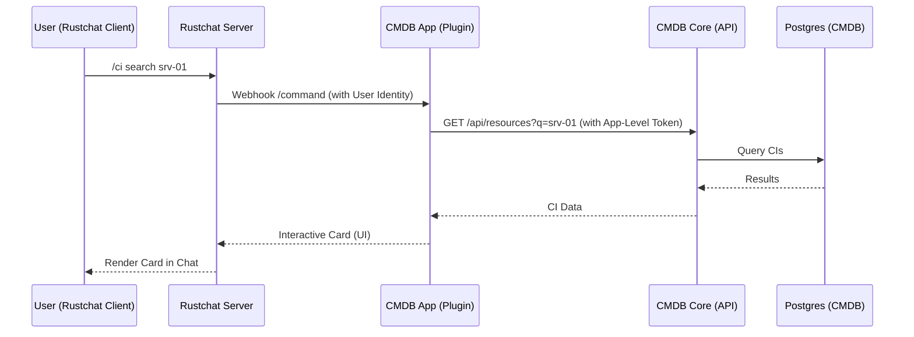

# Architect Spec: Rustchat + CMDB Integration

This document outlines the architecture, auth flow, and UX for embedding the CMDB Discovery and Designer subsystems into the Rustchat enterprise platform.

## 1. Integration Architecture



### Components
1.  **CMDB Core**: Standalone Rust microservice (API + DB).
2.  **Rustchat CMDB App**: A Node.js or Rust sidecar that handles Rustchat webhooks (slash commands, interactive buttons) and renders UI cards.
3.  **Authentication Bridge**: Middleware to trust Rustchat's user identity.

## 2. Authentication: JWT Exchange Flow

We will implement **Option B: JWT Exchange** for the MVP as it allows the CMDB Core to remain lightweight without becoming a full OIDC client.

### Auth Flow
1.  Rustchat App receives a request (e.g., from an App Tab or Command).
2.  App sends the **Rustchat Auth Token** to `cmdb-core/auth/exchange`.
3.  CMDB Core validates the token against Rustchat’s public keys.
4.  CMDB Core issues a **short-lived CMDB JWT** tied to the specific `user_id` and `tenant_id`.

### Pseudocode: Auth Middleware (Rust/Axum)
```rust
async fn auth_middleware<B>(req: Request<B>, next: Next<B>) -> Response {
    let auth_header = req.headers().get(AUTHORIZATION);
    
    // 1. Verify CMDB JWT
    let token = validate_token(auth_header)?;
    
    // 2. Map to Tenant Access
    let tenant_id = token.claims.tenant_id;
    let user_role = db::get_user_role(token.claims.user_id, tenant_id).await?;
    
    // 3. Inject into Request Extensions
    req.extensions_mut().insert(UserContext { tenant_id, user_role });
    
    next.run(req).await
}
```

## 3. Authorization & Tenant Mapping

| Rustchat Context | CMDB Scope | CMDB Role |
| :--- | :--- | :--- |
| **Workspace Admin** | Tenant Admin | `admin` |
| **Team Member** | Tenant Viewer | `viewer` |
| **"CMDB Editors" Group** | Tenant Editor | `editor` |
| **"CMDB Approvers" Group** | Discovery Manager | `approver` |

### Mapping Table
```sql
CREATE TABLE auth_mapping (
    rustchat_team_id TEXT NOT NULL,
    cmdb_tenant_id TEXT NOT NULL,
    role_matching_jsonb JSONB, -- Map RC groups to CMDB roles
    PRIMARY KEY (rustchat_team_id, cmdb_tenant_id)
);
```

## 4. Chat UX & Slash Commands

### Command behaviors
*   `/ci search <query>`: Returns a list of matching CIs.
*   `/ci show <hostname>`: Unfurls a detailed card for the specific CI.
*   `/discovery inbox`: Shows a summary of pending candidates (e.g., "5 new assets detected").
*   `/discovery approve <fingerprint>`: One-click promotion from chat.

### Interactive Card Layout (JSON Schema)
```json
{
  "card": {
    "header": { "title": "CI: srv-prod-01", "subtitle": "Physical Server" },
    "sections": [
        { "label": "IP Address", "value": "10.0.1.50" },
        { "label": "Health", "value": "Healthy", "status": "success" }
    ],
    "actions": [
        { "type": "button", "label": "View Graph", "url": "https://cmdb.io/graph/..." },
        { "type": "button", "label": "Open Incident", "style": "danger" }
    ]
}
```

## 5. API Contract Extensions

To support integration, **CMDB Core** adds the following audit-enriched endpoints:

- `POST /api/discovery/approve`:
    - **Payload**: `{ candidate_id: UUID, actor_id: String, channel_id: String }`
- `GET /api/integration/rustchat/unfurl`:
    - **Payload**: `?url=<internal_ci_url>`
    - **Response**: `CardData`

## 6. Implementation Plan

1.  **Milestone 1: Auth Handshake**
    - Implement `POST /auth/exchange` in `cmdb-core`.
    - Create a simple CLI tool to simulate a Rustchat-to-CMDB login.
2.  **Milestone 2: Command Handler**
    - Build the `rustchat-cmdb` webhook listener.
    - Implement `/ci search` with interactive cards.
3.  **Milestone 3: Discovery Integration**
    - Implement the "Approval" button in-chat.
    - Wire up "Discovery Alerts" to post to specific DevOps channels.

## 7. Security Requirements

- **Tenant Isolation**: Every SQL query MUST include `WHERE tenant_id = $1`. No "superuser" mode for apps.
- **Signed Payload**: Rustchat webhooks must be verified using the `App Secret`.
- **Audit Logging**: Every write action via chat MUST record the `origin_channel_id` and `actor_user_id`.
